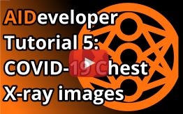

  

AIDeveloper is a software tool that allows you to train, evaluate and apply deep neural nets 
for image classification within a graphical user-interface (GUI).  

# Installation  
There is a tutorial video (ca. 1min. short) on YouTube.  
In this video, I show you how to get AIDeveloper running on your PC.  
  

  
**_If you dont want to watch the video:_**   
Go through the following 5 steps and you are good to go:    
* Go to https://github.com/maikherbig/AIDeveloper/releases
* Download a zip-file (this file contains the **_standalone executable_**)   
* Unzip it  
* Go into the unzipped folder and scroll down until you find an executable (full name is for example "AIDeveloper_0.0.6.exe")  
* DoubleClick this .exe to run it (no installation is required) 

# Tutorials  
## Basic usage  
There is a tutorial video (ca. 13min. short) on YouTube.  
In this video only the very basic functionality of AID is presented. Furthermore, AIDeveloper contains many tooltips, which should help you to proceed further.  

  
  
## Transfer learning    
In a second tutorial (28min), the 'Expert' options of AID are exploited to perform transfer learning.  
First, an existing CNN is loaded into AID. This CNN was trained previously on CIFAR-10 (grayscale) until a validation accuracy of 83%. Next, the Fashion-MNIST dataset is loaded into AID and training of the model is continued on this dataset. At the beginning, only the last layer of the CNN is trained, but later more and more layers are included into training. Also the dropout rates are optimized during the training process until a possibly record breaking testing accuracy of above 92% is reached.  

  
  
## Detecting COVID-19 using chest X-ray images  
In this tutorial, AID is used to tackle a biomedical question that is currently of high interest: diagnosis of COVID-19. One problem is the scarcity of COVID-19 X-ray images, which results in a need of modern regularization techniques to prevent overfitting. First, two other large datasets are used to pre-train a model. Next, this model is optimized for images of COVID-19.
More information and step by step instructions are available [here](https://github.com/maikherbig/AIDeveloper/tree/master/Tutorial%205%20COVID-19%20Chest%20X-ray%20images).  
Furthermore, there is a video showing the analysis procedure from beginning to end:  

## More tutorials  
[Adding models to the model zoo](https://figshare.com/articles/Krater_et_al_2020_Data_zip/9902636)  
[Create standalone using PyInstaller](https://figshare.com/articles/Krater_et_al_2020_Data_zip/9902636)  
[AIDeveloper on AWS with GPU support](https://www.youtube.com/watch?v=C3pMNAg68XQ&t=1818s)  

# Prerequisites  
Since version 0.0.6, the standalone [executables](https://github.com/maikherbig/AIDeveloper/releases) of AIDeveloper are compatible to Windows, Mac and Linux.

The script based version was tested using Python 3.5 on Windows, Mac and Linux. See below to find installation instructions.

# Installation instructions to run AIDeveloper from script
**_you only need to do this if you are a developer/programmer_**
* Install [Visual studio build tools](https://visualstudio.microsoft.com/visual-cpp-build-tools/). During installation, make sure to check C++ Buildtools:

* Get a Python distribution. AIDeveloper was developed using Anaconda3 5.3.1 64bit. You can find this particular version in the installer archive of Anconda: https://repo.continuum.io/archive/
* Download the entire GitHub repository of AIDeveloper: find the green button on the top right ("Clone or download"), click it and then click "Download ZIP"
* Unzip the folder for example to C:\Users\MyPC\Downloads\AIDeveloper_0.0.6
* open Anaconda Prompt
### Option 1: Install dependencies using .yml file
* navigate to the folder where you put AIDeveloper `cd C:\Users\MyPC\Downloads\AIDeveloper_0.0.6`
* Generate an environment using the provided .yml file (AID_myenv_Win7.yml): `conda env create -f aid_env_cpu.yml`
* This will create a new environment called "aid_env_cpu"
* Activate it: `conda activate aid_env_cpu`
* Run AIDeveloper using `python AIDeveloper.py`  
### Option 2: Manually install all dependencies:
`conda create -n aid_env_cpu python=3.5`  
`activate aid_env_cpu`  
`pip install --upgrade setuptools`  
`pip install keras==2.2.4`  
`pip install tensorflow==1.12.3`  
`pip install scikit-learn==0.20.0`  
`pip install dclab==0.22.1`  
`pip install Pillow==5.4.1`  
`pip install pandas==0.24.0 psutil==5.4.7`  
`pip install mkl==2019.0`  
`pip install pyqt5==5.9.2`  
`pip install pyqtgraph==0.11.0rc0`  
`pip install imageio==2.4.1`  
`pip install opencv-contrib-python-headless==4.1.1.26`  
`pip install openpyxl==2.5.6`  
`pip install xlrd==1.1.0`  
`pip install keras2onnx==1.4.0`  
`pip install libopencv`  
`pip install ffmpeg==1.4`  
`pip install tf2onnx==1.4.1`  
`pip install numpy==1.16.4`  

# AIDeveloper in scientific literature  
[1]	[M. Kräter et al., “AIDeveloper: deep learning image classification in life science and beyond,” bioRxiv, p. 2020.03.03.975250, Mar. 2020.](https://www.biorxiv.org/content/10.1101/2020.03.03.975250v1)  
[2]	[A. A. Nawaz et al., “Intelligent image-based deformation-assisted cell sorting with molecular specificity,” Nat. Methods, May 2020.](https://rdcu.be/b4ow4)    
[3]	[T. Krüger et al., “Reliable isolation of human mesenchymal stromal cells from bone marrow biopsy specimens in patients after allogeneic hematopoietic cell transplantation,” Cytotherapy, vol. 22, no. 1, pp. 21–26, Jan. 2020.](https://www.ncbi.nlm.nih.gov/pubmed/31883948)   

# Citing AIDeveloper  
If you use AIDeveloper in a scientific publication, citation of the following paper is appreciated:  
[M. Kräter et al., “AIDeveloper: deep learning image classification in life science and beyond,” bioRxiv, p. 2020.03.03.975250, Mar. 2020.](https://www.biorxiv.org/content/10.1101/2020.03.03.975250v1)  
